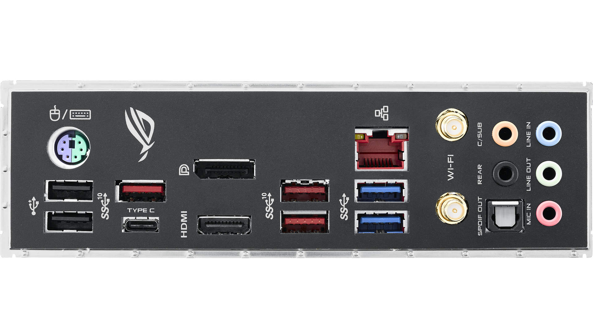
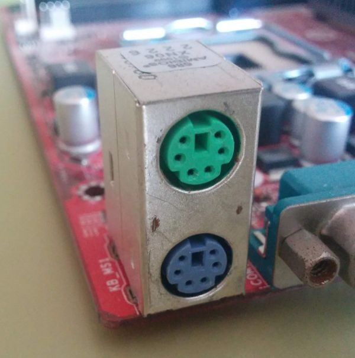
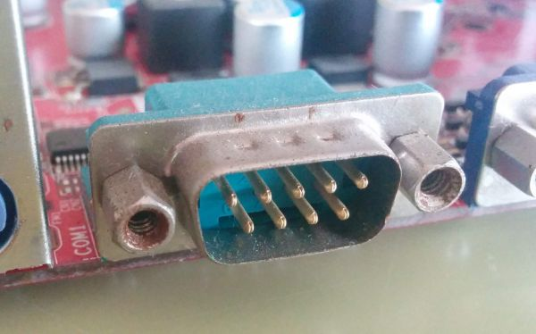
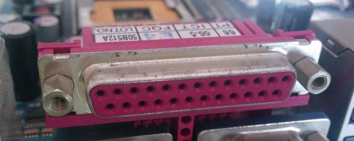
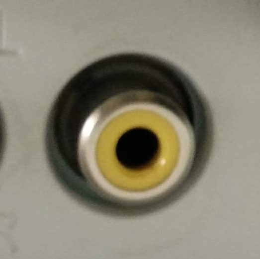
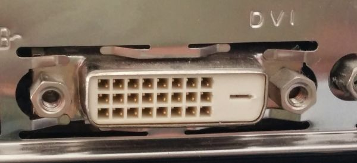
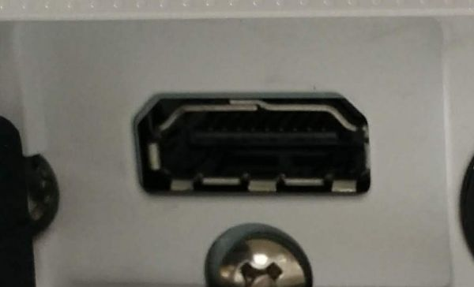

# Tarea 
## Conectores externos

**Conectores externos** son los puertos que permiten a la computadora **comunicarse con otros dispositivos**. Sirven para **transmitir datos, audio, video o energía** a periféricos como teclados, ratones, monitores, impresoras y altavoces.  

Existen diferentes tipos según su función:  
- **Datos:** USB, Thunderbolt, Serie, Paralelo.  
- **Video:** VGA, DVI, HDMI, DisplayPort, S-Vídeo, RCA.  
- **Audio:** Audio Jack, RCA.  
- **Red:** Ethernet.  

Ejemplos: 
  

| **Nombre** | **Características** | **Función** | 
| ------ | ------ | ------ |
| Puerto PS/2  | Conector redondo, más antiguo, generalmente de color verde o morado | Se usa para conectar teclados y ratones, especialmente en computadoras más antiguas |
| HPuerto Serie  | Conector antiguo de 9 o 25 pines, transmite datos de manera secuencial | Se utilizaba para conectar módems, impresoras antiguas, scanners y otros dispositivos externos |
| Puerto Paralelo | Conector ancho de 25 pines, transmite varios bits al mismo tiempo | Se utilizaba principalmente para conectar impresoras antiguas y algunos escáneres |
| RCA   | Conectores de colores (rojo, blanco, amarillo), analógico | Transmitir audio y video en equipos como televisores y consolas |
| DVI  | Conector digital o analógico, transmite video de alta calidad | Conectar monitores modernos, transmite solo video |
| HDMI  | Conector digital que transmite audio y video en alta definición | Conectar monitores, televisores y proyectores, transmite imagen y sonido de calidad |

